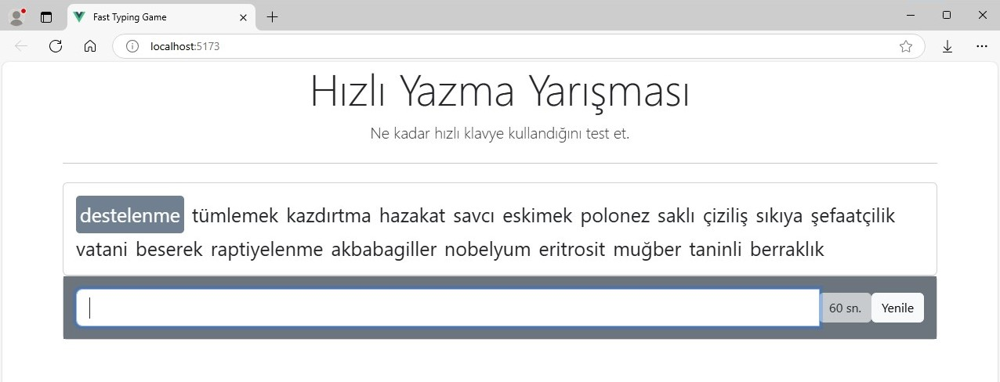
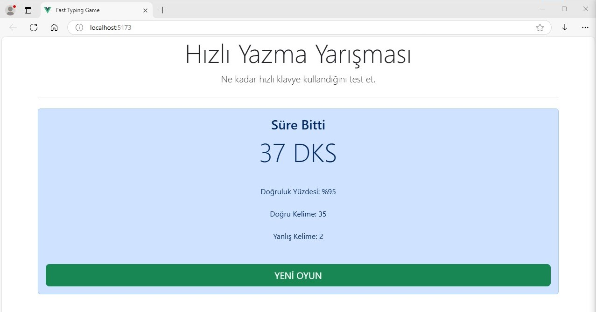

# Fast Typing Game
This project is a "Fast Typing" application that allows users to test their typing speed. Users try to type randomly selected words correctly and quickly while racing against the clock. At the end of the game, the typing speed, accuracy rate, and the number of correct/incorrect words are displayed.

### Project Features:

- **Typing Race:** Users type random words within 60 seconds.
- **Accuracy Check:** The accuracy rate is calculated as the user types.
- **Results Screen:** When time is up, the number of correct words, incorrect words, and the accuracy percentage are shown.
- **New Game Option:** After the game ends, a new game can be started.

## Technologies Used
### Web Development:
- **Vue.js:** The core structure and reactive features of the application were built using Vue.js framework.
- **JavaScript:** Vanilla JavaScript was used for the timer and word validation functionality.

### User Interface:
- **Bootstrap:** Bootstrap framework was used to create a stylish and responsive user interface.
- **CSS Flexbox and Grid:** Flexbox and Grid systems were used to make the design flexible and adaptive.

### Data Management:
- **JSON:** A JSON file was used to provide random words for the game. Words are fetched from this file and shuffled when the game starts.

### Timer and API Operations:
- **JavaScript setInterval:** The setInterval function was used for the timer functionality.

## Recommended IDE Setup

[VSCode](https://code.visualstudio.com/) + [Volar](https://marketplace.visualstudio.com/items?itemName=Vue.volar) (and disable Vetur).

## Customize configuration

See [Vite Configuration Reference](https://vite.dev/config/).

## Project Setup

```sh
npm install
```

### Compile and Hot-Reload for Development

```sh
npm run dev
```

### Compile and Minify for Production

```sh
npm run build
```

### Lint with [ESLint](https://eslint.org/)

```sh
npm run lint
```
## Project Images 



